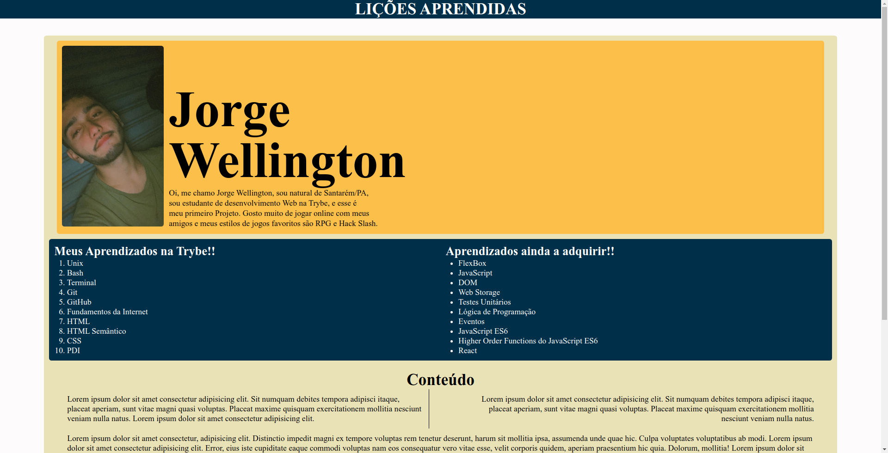

# Seja Bem-vindo ao projeto Lessons Learned!! 👶

### Esse projeto tem como objetivo colocar meus aprendizados de HTML, HTML Semântica, CSS, Seletores e posicionamento em prática. Um projeto simples que me trouxe o primeiro contato com a programação onde construi uma página com conteúdo sobre minha personalidade e lorem (quem sabe sabe hahaha😅).

  

## Tecnologias :

<ul>
  <li>HTML</li>
  <li>CSS</li>
</ul>

## Como executar :

<ul>
  <li>Clone em seu computador (via SHH)</li>    
  <li>instale a extenção Live Server em seu VSCode e execute</li>
</ul>

## Também disponível em :

<a href="https://lessons-learned-rouge.vercel.app/" ><h3>Lessons Learned</h3></a>

## Como contribuir no projeto
  1. Faça um **fork** do projeto;
  2. Crie uma nova branch com as suas alterações: `git checkout -b my-feature`;
  3. Salve as alterações e crie uma mensagem de commit contando o que você fez: `git commit -m "feature: My new feature"`;
  4. Envie as suas alterações: `git push origin my-feature`;
  5. Abra o seu pull-request na página do GitHub.  

##  Autor

<a href="https://www.linkedin.com/in/jorge-reis-dev/" ><h3>Jorge Wellington.</h3></a>

<a href="https://www.linkedin.com">
 <b>Exl</b></a> 

